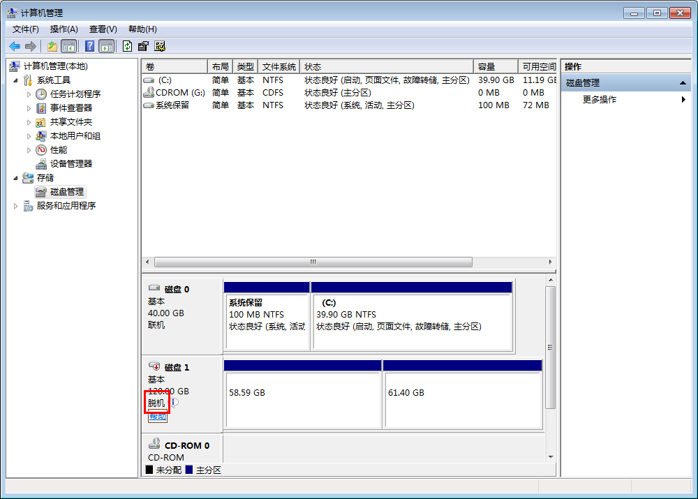
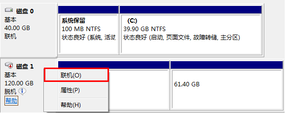

# Windows操作系统的服务器在恢复完成后未显示数据盘

## 现象描述

使用备份恢复服务器成功后，Windows操作系统的服务器上没有显示恢复后的数据盘。

## 可能原因

Windows操作系统自身限制，导致数据盘处于脱机状态。

## 解决方法

1.  在Windows操作系统的服务器桌面，右键单击“计算机“图标。
2.  选择“管理“，弹出“计算机管理“页面。
3.  在左侧导航树中，选择“存储  \>   磁盘管理“。

    此时，可以在页面下方看到有数据盘处于脱机状态，如[图1](#fig413741135513)所示。

    **图 1**  脱机状态的数据盘  
    

4.  右键单击处于脱机状态的数据盘，选择“联机“，如[图2](#fig179301858016)所示。

    **图 2**  联机数据盘  
    

    数据盘置为联机状态后，会在上方的磁盘列表中显示，如[图3](#fig9869427131715)所示。

    联机完成后，数据盘将在服务器中正常显示。

    **图 3**  查看联机的数据盘  
    

