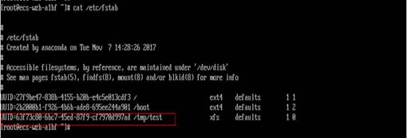
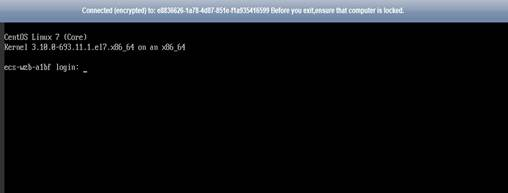
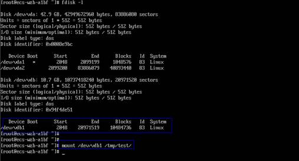

# 使用云服务器备份创建镜像后，镜像创建的云服务器登录后进入维护模式

## 现象描述

使用云服务器备份创建镜像后，通过创建成功的镜像创建云服务器，但登录云服务器后提示系统进入维护模式，无法正常使用云服务器。

## 可能原因

当云服务器带有数据盘的时候，恢复后的云服务器中的系统盘/etc/fstab文件信息仍是原云服务器的配置参数，和新数据盘的UUID信息不匹配，导致云服务器启动过程中加载/etc/fstab信息出错，系统进入维护模式。

## 解决方法

本例以CentOS系统为例介绍解决方法。

1.  使用镜像创建新云服务器后，在云服务器控制台，选择目标云服务器“操作“列下“远程登录”进入云服务器。

    **图 1**  云服务器列表  
    

2.  在维护模式界面，根据提示进入系统。

    **图 2**  系统进入维护模式  
    

3.  执行**cat /etc/fstab**命令查看数据盘挂载信息。

    **图 3**  数据盘UUID信息  
    

4.  执行**vi /etc/fstab**命令打开文件，按**i**进入编辑模式，删除所有数据盘的挂载信息后，按**Ecs**键退出编辑模式，输入**:wq!**退出保存。

    **图 4**  刷新后的/etc/fstab文件  
    

5.  执行**reboot**命令重启系统。

    **图 5**  系统正常启动界面  
    

6.  进入系统后，手动挂载数据盘。

    **图 6**  手动挂载数据盘  
    

7.  执行**blkid**命令获取数据盘的UUID信息。

    **图 7**  获取数据盘UUID信息  
    

8.  执行**vi /etc/fstab**命令打开文件，按**i**进入编辑模式，将数据盘挂载信息添加到**/etc/fstab**文件中，按**Ecs**键退出编辑模式，输入**:wq!**退出保存。

    **图 8**  手动添加数据盘挂载信息  
    

    添加后，系统重启会自动挂载。

