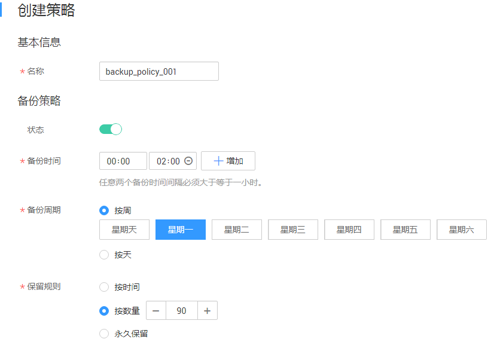
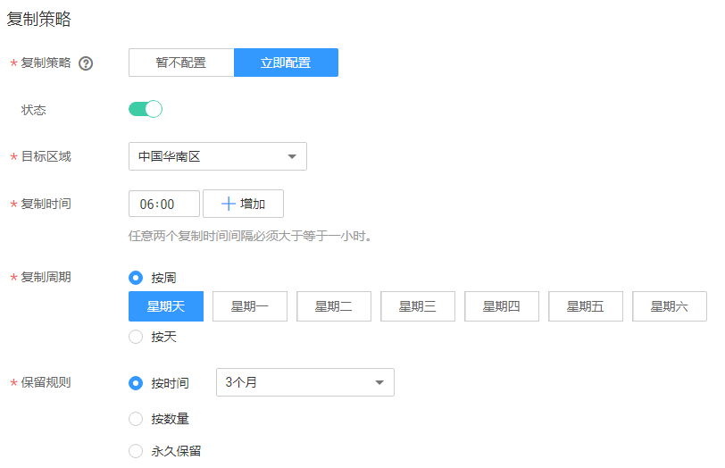

# 创建备份策略

同时，您可以选择性的在备份策略中配置复制策略，周期性的对策略产生的未向目标区域进行过复制或复制失败的备份执行复制操作。

通过备份策略，您可以按照一定的策略要求对服务器数据进行周期性备份，以便服务器在数据丢失或损坏时快速恢复数据，保证业务正常运行。

## 背景信息

-   通过备份策略的方式对云服务器进行周期性备份，仅当启用备份策略后，系统才会自动备份所绑定的服务器，并定期删除过期的备份。
-   每个用户最多只能创建32个备份策略。
-   一个备份策略中最多可以绑定64个服务器。
-   设置备份时间和复制备份的时间时，尽量在确保备份策略执行完毕备份任务已完成后再执行复制策略，否则可能会出现复制备份失败的情况。

## 操作步骤

1.  登录云服务器备份管理控制台。
    1.  登录管理控制台。
    2.  单击，选择“存储 \> 云服务器备份”。

2.  选择“策略“页签，单击页面左上方的“创建备份策略“，如[图1](#fig16333154951014)。

    **图 1**  创建备份策略  
    

3.  设置备份策略信息。各参数说明如[表1](#table18975142115146)所示。

    **表 1**  备份策略参数说明

    
    <table><thead align="left"><tr id="row1997514210149"><th class="cellrowborder" valign="top" width="16.161616161616163%" id="mcps1.2.4.1.1">
参数

    </th>
    <th class="cellrowborder" valign="top" width="50.505050505050505%" id="mcps1.2.4.1.2">
说明

    </th>
    <th class="cellrowborder" valign="top" width="33.333333333333336%" id="mcps1.2.4.1.3">
备注

    </th>
    </tr>
    </thead>
    <tbody><tr id="row4976122191416"><td class="cellrowborder" valign="top" width="16.161616161616163%" headers="mcps1.2.4.1.1 ">
名称

    </td>
    <td class="cellrowborder" valign="top" width="50.505050505050505%" headers="mcps1.2.4.1.2 ">
设置备份策略的名称。

    
只能由中文字符、英文字母、数字、下划线、中划线组成，且长度小于等于255个字符。

    </td>
    <td class="cellrowborder" valign="top" width="33.333333333333336%" headers="mcps1.2.4.1.3 ">
backup_policy

    </td>
    </tr>
    <tr id="row1248223165716"><td class="cellrowborder" valign="top" width="16.161616161616163%" headers="mcps1.2.4.1.1 ">
是否启用

    </td>
    <td class="cellrowborder" valign="top" width="50.505050505050505%" headers="mcps1.2.4.1.2 ">
设置备份策略的启用状态。

    <ul id="ul14659163365820"><li>启用：</li><li>禁用：</li></ul>
    </td>
    <td class="cellrowborder" valign="top" width="33.333333333333336%" headers="mcps1.2.4.1.3 ">
仅当启用备份策略后，系统才会自动备份所绑定的服务器，并定期删除过期的备份。

    </td>
    </tr>
    <tr id="row1631531981516"><td class="cellrowborder" valign="top" width="16.161616161616163%" headers="mcps1.2.4.1.1 ">
备份时间

    </td>
    <td class="cellrowborder" valign="top" width="50.505050505050505%" headers="mcps1.2.4.1.2 ">
设置备份任务在一天之内的执行时间点。

    
最多支持在一天内设置24个备份时间，且任意两个备份时间间隔必须大于等于一小时。如果连续两天进行备份，第一天的最后一次备份时间与第二天的第一次备份时间间隔也需要大于等于一小时。

    

    </td>
    <td class="cellrowborder" valign="top" width="33.333333333333336%" headers="mcps1.2.4.1.3 ">
00:00，02:00

    
建议选择无业务或者业务量较少的时间进行备份。

    </td>
    </tr>
    <tr id="row8447021201515"><td class="cellrowborder" valign="top" width="16.161616161616163%" headers="mcps1.2.4.1.1 ">
备份周期

    </td>
    <td class="cellrowborder" valign="top" width="50.505050505050505%" headers="mcps1.2.4.1.2 ">
设置备份任务的执行日期。

    <ul id="ul172457131819"><li>按周
指定备份策略在每周的周几进行备份，可以多选。

    </li><li>按天
指定备份策略每隔几天进行一次备份，可设置1～30天。

    </li></ul>
    </td>
    <td class="cellrowborder" valign="top" width="33.333333333333336%" headers="mcps1.2.4.1.3 ">
每1天

    
当选择按天备份时，理论上第一次备份的时间为备份策略创建当天。如果当天备份策略创建的时间已经晚于设置的备份时间，那么将会等到第二个备份周期再进行第一次备份。

    
建议选择无业务或者业务量较少的时间进行备份。

    </td>
    </tr>
    <tr id="row9482950131718"><td class="cellrowborder" valign="top" width="16.161616161616163%" headers="mcps1.2.4.1.1 ">
保留规则

    </td>
    <td class="cellrowborder" valign="top" width="50.505050505050505%" headers="mcps1.2.4.1.2 ">
设置备份产生后的保留规则。

    <ul id="ul1544815182330"><li>按时间
可选择1个月、3个月、6个月、1年的固定保留时长或根据需要自定义保留时长。取值范围为1～99999天。

    </li><li>按数量
单个云服务器执行备份策略保留的备份总份数。取值范围为1～99999个。

    </li><li>永久保留
 说明： 
<ul id="ul513693919476"><li>当保留的备份数超过设置的数值时，系统会自动删除最早创建的备份，当保留的备份超过设定的时间时，系统会自动删除所有过期的备份；系统默认每隔一天自动清理，每次自动或手动调度也会触发系统清理，默认清理时间为00 : 00。删除的备份不会影响其他备份用于恢复。</li><li>保留规则仅对备份策略自动调度生成的备份有效。手动执行备份策略生成的备份不会统计在内，且不会自动删除。如需删除，请在备份页签的备份列表中手动删除。</li><li>当备份创建过镜像之后，该备份不会继续统计在保留规则中，也不会自动删除。</li><li>周期性备份产生的失败的备份最多保留10个，保留时长1个月，可手动删除。</li></ul>
    

    </li></ul>
    </td>
    <td class="cellrowborder" valign="top" width="33.333333333333336%" headers="mcps1.2.4.1.3 ">
6个月

    </td>
    </tr>
    </tbody>
    </table>

    > **说明：**   
    >服务器备份越频繁，保留的备份份数越多或时间越长，对数据的保护越充分，但是占用的存储空间也越大。请根据数据的重要级别和业务量综合考虑选择，重要的数据采用较短的备份周期，且保留较多的备份份数或较长时间。  

4.  配置复制策略，如[图2](#fig1120617548513)所示。

    复制相关的约束与限制请参见[约束与限制](复制备份（跨区域）.md#section789722492715)。

    **图 2**  配置复制策略  
    

    配置复制策略后，将周期性的对策略产生的未向目标区域进行过复制或复制失败的备份执行复制操作。参数说明如[表2](#table754912271881)所示。

    **表 2**  复制策略参数说明

    
    <table><thead align="left"><tr id="row175582276815"><th class="cellrowborder" valign="top" width="16.16161616161616%" id="mcps1.2.4.1.1">
参数

    </th>
    <th class="cellrowborder" valign="top" width="55.55555555555556%" id="mcps1.2.4.1.2">
说明

    </th>
    <th class="cellrowborder" valign="top" width="28.28282828282828%" id="mcps1.2.4.1.3">
备注

    </th>
    </tr>
    </thead>
    <tbody><tr id="row05675275817"><td class="cellrowborder" valign="top" width="16.16161616161616%" headers="mcps1.2.4.1.1 ">
复制策略

    </td>
    <td class="cellrowborder" valign="top" width="55.55555555555556%" headers="mcps1.2.4.1.2 ">
选择是否为该备份策略配置对应的复制策略。

    </td>
    <td class="cellrowborder" valign="top" width="28.28282828282828%" headers="mcps1.2.4.1.3 ">
立即配置

    </td>
    </tr>
    <tr id="row1757710278814"><td class="cellrowborder" valign="top" width="16.16161616161616%" headers="mcps1.2.4.1.1 ">
状态

    </td>
    <td class="cellrowborder" valign="top" width="55.55555555555556%" headers="mcps1.2.4.1.2 ">
设置复制策略的启用状态。

    <ul id="ul8584132710814"><li>启用：</li><li>禁用：</li></ul>
    </td>
    <td class="cellrowborder" valign="top" width="28.28282828282828%" headers="mcps1.2.4.1.3 ">
仅当启用复制策略后，以下配置才生效。

    </td>
    </tr>
    <tr id="row176076277810"><td class="cellrowborder" valign="top" width="16.16161616161616%" headers="mcps1.2.4.1.1 ">
目标区域

    </td>
    <td class="cellrowborder" valign="top" width="55.55555555555556%" headers="mcps1.2.4.1.2 ">
选择备份数据需要复制到的目标区域。

    
只有具备复制能力的区域才会在目标区域中展示。

    <ul id="ul649081582612"><li>如果所选区域只有一个项目，则直接选择区域名称即可。</li><li>如果所选区域有多个项目，默认选择该区域下的主项目，也可以根据需要选择其他项目。</li></ul>
    </td>
    <td class="cellrowborder" valign="top" width="28.28282828282828%" headers="mcps1.2.4.1.3 ">
华南-广州

    </td>
    </tr>
    <tr id="row1961722719815"><td class="cellrowborder" valign="top" width="16.16161616161616%" headers="mcps1.2.4.1.1 ">
复制时间

    </td>
    <td class="cellrowborder" valign="top" width="55.55555555555556%" headers="mcps1.2.4.1.2 ">
设置复制任务在一天之内的执行时间点。

    
最多支持在一天内设置24个备份时间，且任意两个复制时间间隔必须大于等于一小时。如果连续两天进行复制，第一天的最后一次复制时间与第二天的第一次复制时间间隔也需要大于等于一小时。

    

    </td>
    <td class="cellrowborder" valign="top" width="28.28282828282828%" headers="mcps1.2.4.1.3 ">
00:00，12:00

    </td>
    </tr>
    <tr id="row136302027887"><td class="cellrowborder" valign="top" width="16.16161616161616%" headers="mcps1.2.4.1.1 ">
复制周期

    </td>
    <td class="cellrowborder" valign="top" width="55.55555555555556%" headers="mcps1.2.4.1.2 ">
设置复制任务的执行日期。

    <ul id="ul156377273810"><li>按周
指定复制策略在每周的周几执行，可以多选。

    </li><li>按天
指定复制策略每隔几天执行一次，可设置1～30天。

    </li></ul>
    </td>
    <td class="cellrowborder" valign="top" width="28.28282828282828%" headers="mcps1.2.4.1.3 ">
每1天

    
当选择按天复制时，理论上第一次复制的时间为复制策略创建当天。如果当天复制策略创建的时间已经晚于设置的复制时间，那么将会等到第二个复制周期再进行第一次复制。

    </td>
    </tr>
    <tr id="row10650727287"><td class="cellrowborder" valign="top" width="16.16161616161616%" headers="mcps1.2.4.1.1 ">
保留规则

    </td>
    <td class="cellrowborder" valign="top" width="55.55555555555556%" headers="mcps1.2.4.1.2 ">
设置复制到目标区域的目标备份的保留规则。

    <ul id="ul196551027184"><li>按时间
可选择1个月、3个月、6个月、1年的固定保留时长或根据需要自定义保留时长。取值范围为1～99999天。

    </li><li>按数量
单个云服务器保留的复制总份数。取值范围为1～99999个。

    </li><li>永久保留
 说明： 
<ul id="ul116661273815"><li>当保留的复制数超过设置的数值时，系统会自动删除最早创建的复制，当保留的复制超过设定的时间时，系统会自动删除所有过期的复制；系统默认每隔一天自动清理，每次自动或手动调度也会触发系统清理，默认清理时间为00 : 00。</li><li>保留规则仅对复制策略自动调度生成的复制有效。手动执行复制策略生成的复制不会统计在内，且不会自动删除。如需删除，请在目标区域备份页签的备份列表中手动删除。</li><li>当复制创建过镜像之后，该复制不会继续统计在保留规则中，也不会自动删除。</li></ul>
    

    </li></ul>
    </td>
    <td class="cellrowborder" valign="top" width="28.28282828282828%" headers="mcps1.2.4.1.3 ">
6个月

    </td>
    </tr>
    </tbody>
    </table>

5.  设置完成后，单击“确定”，完成备份策略的创建。
6.  在备份策略所在行，单击“绑定服务器“，如[图3](#fig1313918415212)。

    **图 3**  绑定服务器  
    

7.  在服务器列表中勾选需要绑定的服务器，勾选后将在已选服务器区域展示。

    > **说明：**   
    >-   一个备份策略中最多可以绑定64个服务器。  
    >-   如果选择的服务器已经绑定到其他备份策略，在选择新的备份策略后，服务器会自动从原备份策略解绑，并绑定到新的备份策略。  
    >-   如果服务器中有云硬盘已经加入云硬盘备份策略中，建议在云硬盘备份服务的备份策略中移除该服务器的云硬盘，否则云硬盘将产生两个备份。  
    >-   支持绑定服务器中的共享云硬盘。  
    >-   只能选择状态为“运行中”或“关机”的服务器。  

8.  单击“确定”。

