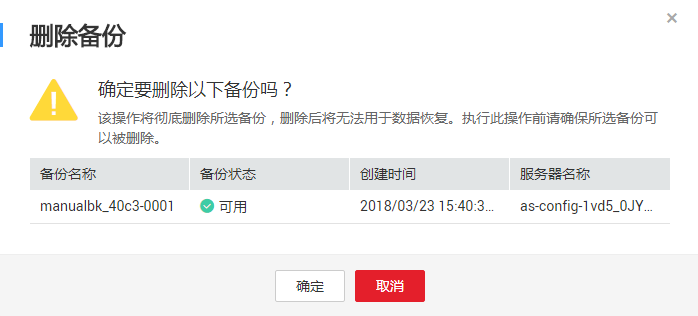

# 删除备份

用户可以根据实际情况删除无用的备份以节省空间和成本。

## 背景信息

云服务器备份支持两种方式删除备份：手动删除和过期自动删除。过期自动删除备份可以通过设置备份策略中的保留规则来实现，详情请参见[创建备份策略](创建备份策略.md)。

## 前提条件

-   至少存在一个备份。
-   备份的状态为“可用”或者“错误”。

## 操作步骤

1.  登录云服务器备份管理控制台。
    1.  登录管理控制台。
    2.  单击，选择“存储 \> 云服务器备份”。

2.  选择“备份“页签，找到服务器所对应的备份，具体操作参见[查看备份](查看备份.md)。
3.  单击备份所在行的“更多“\>“删除“，如[图1](#fig1625973075718)所示，或批量勾选需要删除的备份，单击左上角的“删除”。

    **图 1**  删除备份  
    

4.  根据界面提示，单击“确定”。

