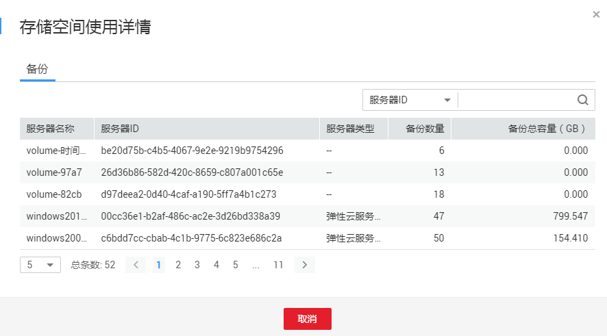

# 查看备份

在备份任务下发或完成后，可以通过各种筛选条件在备份列表查看备份详情。

## 前提条件

备份任务已创建。

## 查看备份详情

1.  登录云服务器备份管理控制台。
    1.  登录管理控制台。
    2.  单击，选择“存储 \> 云服务器备份”。

2.  选择“备份“页签，通过筛选条件查看备份。
    -   通过备份列表右上角的状态查询备份。

        备份的状态取值如[表1](#table27644511104124)。   

        **表 1**  备份状态说明

        
        <table><thead align="left"><tr id="row60378258104124"><th class="cellrowborder" valign="top" width="13%" id="mcps1.2.4.1.1">
状态

        </th>
        <th class="cellrowborder" valign="top" width="14.000000000000002%" id="mcps1.2.4.1.2">
状态属性

        </th>
        <th class="cellrowborder" valign="top" width="73%" id="mcps1.2.4.1.3">
说明

        </th>
        </tr>
        </thead>
        <tbody><tr id="row3808446420388"><td class="cellrowborder" valign="top" width="13%" headers="mcps1.2.4.1.1 ">
所有状态

        </td>
        <td class="cellrowborder" valign="top" width="14.000000000000002%" headers="mcps1.2.4.1.2 ">
--

        </td>
        <td class="cellrowborder" valign="top" width="73%" headers="mcps1.2.4.1.3 ">
显示所有备份。

        </td>
        </tr>
        <tr id="row24922559104124"><td class="cellrowborder" valign="top" width="13%" headers="mcps1.2.4.1.1 ">
可用

        </td>
        <td class="cellrowborder" valign="top" width="14.000000000000002%" headers="mcps1.2.4.1.2 ">
稳定状态

        </td>
        <td class="cellrowborder" valign="top" width="73%" headers="mcps1.2.4.1.3 ">
备份完成之后的稳定状态。

        
该状态下可以执行各种操作。

        </td>
        </tr>
        <tr id="row18418804104124"><td class="cellrowborder" valign="top" width="13%" headers="mcps1.2.4.1.1 ">
创建中

        </td>
        <td class="cellrowborder" valign="top" width="14.000000000000002%" headers="mcps1.2.4.1.2 ">
中间状态

        </td>
        <td class="cellrowborder" valign="top" width="73%" headers="mcps1.2.4.1.3 ">
从开始备份到备份完成中间的状态。

        
该状态下会有进度条提示备份的完成情况，如果进度条长时间不变，则说明出现异常，需要联系客服处理。

        </td>
        </tr>
        <tr id="row38153904104124"><td class="cellrowborder" valign="top" width="13%" headers="mcps1.2.4.1.1 ">
恢复中

        </td>
        <td class="cellrowborder" valign="top" width="14.000000000000002%" headers="mcps1.2.4.1.2 ">
中间状态

        </td>
        <td class="cellrowborder" valign="top" width="73%" headers="mcps1.2.4.1.3 ">
使用备份恢复数据的中间状态。

        
该状态下会有进度条提示备份恢复的完成情况，如果进度条长时间不变，则说明出现异常，需要联系客服处理。

        </td>
        </tr>
        <tr id="row30853749104124"><td class="cellrowborder" valign="top" width="13%" headers="mcps1.2.4.1.1 ">
删除中

        </td>
        <td class="cellrowborder" valign="top" width="14.000000000000002%" headers="mcps1.2.4.1.2 ">
中间状态

        </td>
        <td class="cellrowborder" valign="top" width="73%" headers="mcps1.2.4.1.3 ">
删除备份到删除完成中间的状态。

        
该状态下会有进度条提示备份删除的完成情况，如果进度条长时间不变，则说明出现异常，需要联系客服处理。

        </td>
        </tr>
        <tr id="row3832257104124"><td class="cellrowborder" valign="top" width="13%" headers="mcps1.2.4.1.1 ">
错误

        </td>
        <td class="cellrowborder" valign="top" width="14.000000000000002%" headers="mcps1.2.4.1.2 ">
稳定状态

        </td>
        <td class="cellrowborder" valign="top" width="73%" headers="mcps1.2.4.1.3 ">
当执行过程中出现异常情况时，备份的“备份状态”会变成“错误”。

        
此状态下的备份不能用来恢复，需要手动删除。如果手动删除无法完成，需要联系客服处理。

        </td>
        </tr>
        </tbody>
        </table>

    -   通过备份列表右上角的备份创建时间段查询备份。
    -   通过服务器名称、服务器ID、备份的名称、服务器类型、复制或备份的ID进行搜索，单击查询备份。

        对于复制而来的备份，在备份名称右侧会显示代表复制的小图标：。

3.  单击备份前的，可以展开查看备份的详情。

## 查看备份容量信息

1.  登录云服务器备份管理控制台。
    1.  登录管理控制台。
    2.  单击，选择“存储 \> 云服务器备份”。

2.  选择“备份“页签，单击备份信息概览中的存储空间数字链接，如[图1](#fig2046217271114)所示。

    **图 1**  备份信息概览  
    

3.  在弹出的对话框中查看存储空间使用详情。

    每一条信息代表一台服务器。其中“备份数量“表示该服务器现存的备份数量总和；“备份总容量（GB）“则表示该服务器现存的备份所占容量大小总和。

    **图 2**  存储空间使用详情  
    

